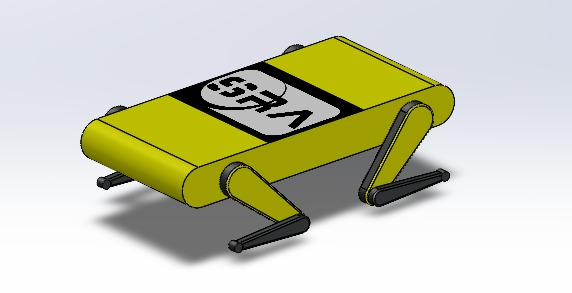
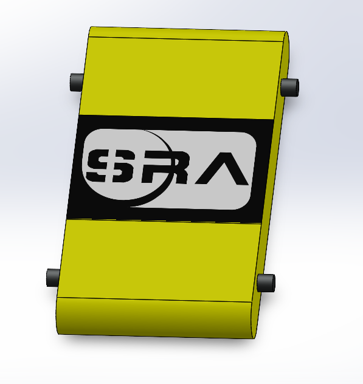
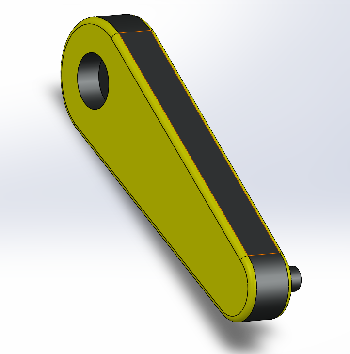
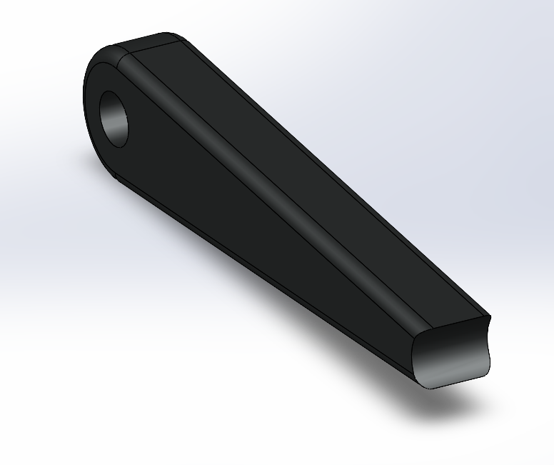
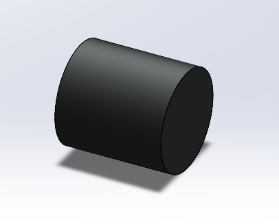

# Dimensions Workshop 2021
* SolidWorks is a very versatile industrial software for designing varied type components. In this workshop we will be teaching you the basics of designing in Solidworks 2021 by going through the design of a basic Quadruped.  

  

# Part Descriptions
* The bot contains a total of 4 components which are as listed in the following table :

|     Parts    |          Description          |
| ------------ | ----------------------------- |
| 

   | Quad_base - This is the base of the bot,  which is connected to all the four legs through revolute joints|
   | Quad_Mid - This is the shoulder link of the bot,  which is the connecting link between the base and the Leg|  
    | Quad_Leg - This is part is the Leg of the bot|   
    | Quad_Foot - This part sits beneath the leg and   has a material which provides a proper grip the the bot|  

   

# Installation Requirements
* There are some important requirements for the installation of Solidworks 2021
  * Laptop requirements - 
    * **Windows 7 (64 bit) or higher**
  * As the size of the software is close to 20 Gb. You will need **20 Gb of freespace** in your device.
  * You will need a stable internet connection for downloading close to **20 Gb** of data.
  * You will be needing the WinRAR for extracting files. Be sure to check the version (5.71 32 bit). If you dont have WinRAR or the same version, you can download it from [here](https://www.winrarfree.net/download-file/for-windows/version-5.71/wrar571.exe).
  * You must have .NET Framework **V4.7.2 or higher** (Check your .Net version by following [this](https://support.citrix.com/article/CTX224771)). If you dont have that upgrade to the latest version 
    * [For Windows 10](https://dotnet.microsoft.com/download/dotnet-framework/net48)
    <!--* [For Windows 8/7](https://dotnet.microsoft.com/download/dotnet-framework/net472)  -->
   
# Installation 
* For the installation of SolidWorks 2021 follow the below mentioned steps
  * First download the installation setup from this [link](https://allpcworld.com/solidworks-premium-2021-free-download-712546/)
  * Turn-off your “Internet Connection”.
  * Turn-off “Windows Defender” real-time protection. 
    For doing so in windows, go to “Start Menu” and search “Windows Defender” or “Defender”.
  * If you have any other Antivirus Program in your PC, then Turn-off their protection.
  * Refer [this video](https://www.youtube.com/watch?v=YwwOqODxwq8) for the further installation instructions
  * When installation is completed, you can “Turn-On Everything.”
